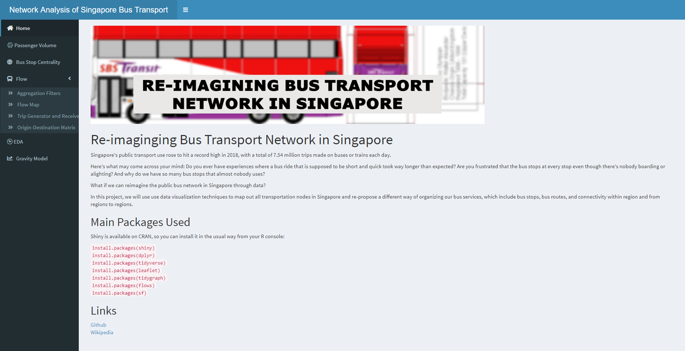

# LTA Bus Analysis

The wiki page, incl Proposal, Research Paper, and Poster, is available at [this link](https://wiki.smu.edu.sg/1920t2isss608/Group08_proposal)
Application is available at [this link](https://cjy93.shinyapps.io/projrshiny_master/)

Author:
[Chan Jiayi](https://www.linkedin.com/in/jiayi-chan123456/)
[Mengyong Lee](https://www.linkedin.com/in/mylee1/)

We will do a brief run through on how to run the files.
First download /clone the whole package to your local machine. Open up "global.R", "ui.R", "server.R" on R studio. Go to either one of the files and "runApp()"

## Home Page

1. Home page provides a link to our project wiki page, where users can find the userguide as well as the report for this project.  

## Passenger Volume

2. Passenger Volume app allows users to see the passenger volume by subzone level, planning area level or whole singapore level where each dot is one busstop. The volume is by volume of tap ins or tap outs. Users can also select by weekends/holidays or weekdays.  

## BusStop Centrality
  
3. Users can choose the region by Singapore, Planning Area or by Subzone. If users choose Planning Area, they should do a subfilter by choosing a Planning Area under the drop down menu. If users chose Subzone, they can choose a subzone from the drop down menu. After users has chosen the region filters, they can choose the centrality filter and the magnitude of centrality.  
* Our app has taken into account of Conditional panel for Region filters, but it apparently did not work properly in "Passenger Volume" and "BusStop Centrality" app after the team as added the other apps. Reason unknown, KIV for the meantime. Do let us know if you have a solution to fix this! Thanks :))   

## Flows
  
4. Before users embark in any of the flows apps, they have to perform the filtering of regions in this app first. In this app, the conditional panel are working fine. If users choose region by Planning Area, they have to choose a source and destination. Similiarly for subzones. Users can choose more than one input for source and destination.  

  
5. Users will see that there are a few links between source and destinations as we have picked a few source and destination nodes from aggregate filter. Users can filter future by node size sliders and edge size sliders. Users can also filter by day of the weeks as well as source district and destination district to limit the visual further.  

  
6. Since the flow Map cannot intuitively show users who are the source nodes and who are the destination nodes, we can see it with this Sankey diagram, where the nodes on the left are the source and the nodes on the right are the destination nodes.  

   
7. The Origin-Destination matrix gives us a sense of who are the more important nodes and edges between the travelling nodes and edges. Understandably, the flows for dominance matrix looks apparently empty. This is normal as discussed in the report, that most of the dominance flows are empty. We will be able to see clearly which nodes are non empty if we look at the whole of Singapore's origin destination matrix, which is rare and few.  

## EDA
   
8. Users can have a overview of the data for tap in and tap out vs the 4 centrality measures. The overview includes a density plot to see the distribution, Correlation Matrix as well as bivariate analysis graphs.  

## Regression Analysis
   
9. Similar to the above, we allow users to choose Y and X variables where Y are from tap in or tap out, X are from the 4 centrality measures in our topic, namely : Closeness, degree, betweeness and eigenvalue centrality. We do a regression model to find the p and adjusted R square values as well as check the model assumptions. The model is built upon transformed variables as the original variables are not normally distributed
